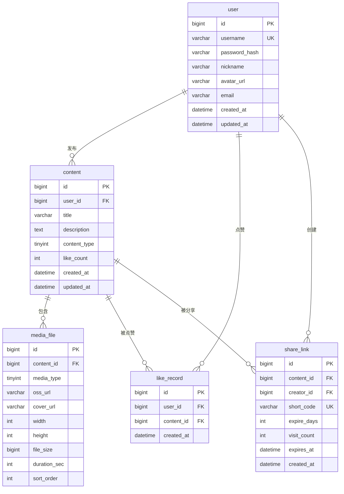

# 数据库设计文档 — Cloud Social Platform

> 版本：v1.0 ｜ 数据库：`social_platform`（utf8mb4）｜ 引擎：InnoDB

## 1. ER 图



## 2. 表结构定义

### 2.1 `user` — 用户表

| 字段 | 类型 | 约束 | 说明 |
|---|---|---|---|
| id | BIGINT | PK, AUTO_INCREMENT | 主键 |
| username | VARCHAR(64) | UNIQUE, NOT NULL | 登录名 |
| password_hash | VARCHAR(255) | NOT NULL | BCrypt 哈希 |
| nickname | VARCHAR(64) | NOT NULL | 昵称 |
| avatar_url | VARCHAR(512) | NULL | 头像 OSS 地址 |
| email | VARCHAR(128) | NULL | 邮箱 |
| created_at | DATETIME | NOT NULL | 创建时间 |
| updated_at | DATETIME | NOT NULL | 更新时间 |

**索引**：`uk_username(username)`、`idx_created_at(created_at)`

### 2.2 `content` — 内容表（帖子）

| 字段 | 类型 | 约束 | 说明 |
|---|---|---|---|
| id | BIGINT | PK | 主键 |
| user_id | BIGINT | FK→user, NOT NULL | 作者 |
| title | VARCHAR(255) | NOT NULL | 标题 |
| description | TEXT | NULL | 描述 |
| content_type | TINYINT | NOT NULL | 1=图文 2=视频 3=混合 |
| like_count | INT | DEFAULT 0 | 点赞数（Redis 同步） |
| created_at | DATETIME | NOT NULL, INDEX | 创建时间 |
| updated_at | DATETIME | NOT NULL | 更新时间 |

**索引**：`idx_user_created(user_id, created_at)`（Feed 流按作者+时间）、`idx_created_at(created_at)`（全局时间线）

### 2.3 `media_file` — 媒体文件表

| 字段 | 类型 | 约束 | 说明 |
|---|---|---|---|
| id | BIGINT | PK | 主键 |
| content_id | BIGINT | FK→content, NOT NULL | 所属内容 |
| media_type | TINYINT | NOT NULL | 1=图片 2=视频 |
| oss_url | VARCHAR(512) | NOT NULL | OSS 访问地址 |
| cover_url | VARCHAR(512) | NULL | 视频封面/缩略图 |
| width | INT | NULL | 宽(px) |
| height | INT | NULL | 高(px) |
| file_size | BIGINT | NULL | 字节数 |
| duration_sec | INT | NULL | 视频时长(秒) |
| sort_order | INT | DEFAULT 0 | 排序（图文混排顺序） |

**索引**：`idx_content(content_id)`

### 2.4 `like_record` — 点赞记录表

| 字段 | 类型 | 约束 | 说明 |
|---|---|---|---|
| id | BIGINT | PK | 主键 |
| user_id | BIGINT | FK→user, NOT NULL | 点赞人 |
| content_id | BIGINT | FK→content, NOT NULL | 被赞内容 |
| created_at | DATETIME | NOT NULL | 点赞时间 |

**核心索引**：`uk_user_content(user_id, content_id)` — **联合唯一索引，防重复点赞（幂等核心）**
**辅助索引**：`idx_content_created(content_id, created_at)`（排行榜统计）、`idx_user(user_id)`

### 2.5 `share_link` — 分享链接表

| 字段 | 类型 | 约束 | 说明 |
|---|---|---|---|
| id | BIGINT | PK | 主键 |
| content_id | BIGINT | FK→content, NOT NULL | 被分享内容 |
| creator_id | BIGINT | FK→user, NOT NULL | 创建人 |
| short_code | VARCHAR(8) | UNIQUE, NOT NULL | Base62 短码 |
| expire_days | INT | NOT NULL | 0=永久 / 7 / 30 |
| visit_count | INT | DEFAULT 0 | 访问次数 |
| expires_at | DATETIME | NULL | 过期时间 |
| created_at | DATETIME | NOT NULL | 创建时间 |

**索引**：`uk_short_code(short_code)`（短链查询核心）、`idx_content(content_id)`

## 3. 缓存设计（Redis）

| Key | 类型 | 说明 | TTL |
|---|---|---|---|
| `like_count:{contentId}` | String | 内容实时点赞数 | 永久（定时落库） |
| `like:user:{userId}:{contentId}` | String | 是否已赞（防重复） | 7 天 |
| `like:rate:{userId}:{contentId}` | ZSET | 点赞滑动窗口限流 | 1 分钟 |
| `share:{shortCode}` | String | 短链→内容 ID 映射 | 与库一致 |
| `share:rate:{ip}` | ZSET | 分享访问限流 | 1 小时 |

## 4. 数据一致性策略

1. **点赞计数**：Redis 为实时计数源，定时任务（每 5 分钟）将增量同步到 `content.like_count`，最终一致
2. **点赞幂等**：`uk_user_content` 联合唯一索引兜底，Redis 预判加速
3. **短链双写**：Redis + MySQL 双写，读走 Redis，写同步 MySQL（先库后缓存）
4. **删除策略**：软删除（内容表加 `deleted` 标记），不物理删除媒体文件，避免误删

## 5. 建表 SQL（schema.sql）

```sql
CREATE TABLE IF NOT EXISTS user (
  id BIGINT PRIMARY KEY AUTO_INCREMENT,
  username VARCHAR(64) NOT NULL,
  password_hash VARCHAR(255) NOT NULL,
  nickname VARCHAR(64) NOT NULL,
  avatar_url VARCHAR(512),
  email VARCHAR(128),
  created_at DATETIME NOT NULL DEFAULT CURRENT_TIMESTAMP,
  updated_at DATETIME NOT NULL DEFAULT CURRENT_TIMESTAMP ON UPDATE CURRENT_TIMESTAMP,
  UNIQUE KEY uk_username (username)
) ENGINE=InnoDB DEFAULT CHARSET=utf8mb4 COLLATE=utf8mb4_unicode_ci;

CREATE TABLE IF NOT EXISTS content (
  id BIGINT PRIMARY KEY AUTO_INCREMENT,
  user_id BIGINT NOT NULL,
  title VARCHAR(255) NOT NULL,
  description TEXT,
  content_type TINYINT NOT NULL DEFAULT 1,
  like_count INT NOT NULL DEFAULT 0,
  deleted TINYINT NOT NULL DEFAULT 0,
  created_at DATETIME NOT NULL DEFAULT CURRENT_TIMESTAMP,
  updated_at DATETIME NOT NULL DEFAULT CURRENT_TIMESTAMP ON UPDATE CURRENT_TIMESTAMP,
  KEY idx_user_created (user_id, created_at),
  KEY idx_created_at (created_at)
) ENGINE=InnoDB DEFAULT CHARSET=utf8mb4 COLLATE=utf8mb4_unicode_ci;

CREATE TABLE IF NOT EXISTS media_file (
  id BIGINT PRIMARY KEY AUTO_INCREMENT,
  content_id BIGINT NOT NULL,
  media_type TINYINT NOT NULL,
  oss_url VARCHAR(512) NOT NULL,
  cover_url VARCHAR(512),
  width INT,
  height INT,
  file_size BIGINT,
  duration_sec INT,
  sort_order INT NOT NULL DEFAULT 0,
  KEY idx_content (content_id)
) ENGINE=InnoDB DEFAULT CHARSET=utf8mb4 COLLATE=utf8mb4_unicode_ci;

CREATE TABLE IF NOT EXISTS like_record (
  id BIGINT PRIMARY KEY AUTO_INCREMENT,
  user_id BIGINT NOT NULL,
  content_id BIGINT NOT NULL,
  created_at DATETIME NOT NULL DEFAULT CURRENT_TIMESTAMP,
  UNIQUE KEY uk_user_content (user_id, content_id),
  KEY idx_content_created (content_id, created_at)
) ENGINE=InnoDB DEFAULT CHARSET=utf8mb4 COLLATE=utf8mb4_unicode_ci;

CREATE TABLE IF NOT EXISTS share_link (
  id BIGINT PRIMARY KEY AUTO_INCREMENT,
  content_id BIGINT NOT NULL,
  creator_id BIGINT NOT NULL,
  short_code VARCHAR(8) NOT NULL,
  expire_days INT NOT NULL DEFAULT 0,
  visit_count INT NOT NULL DEFAULT 0,
  expires_at DATETIME,
  created_at DATETIME NOT NULL DEFAULT CURRENT_TIMESTAMP,
  UNIQUE KEY uk_short_code (short_code),
  KEY idx_content (content_id)
) ENGINE=InnoDB DEFAULT CHARSET=utf8mb4 COLLATE=utf8mb4_unicode_ci;
```
